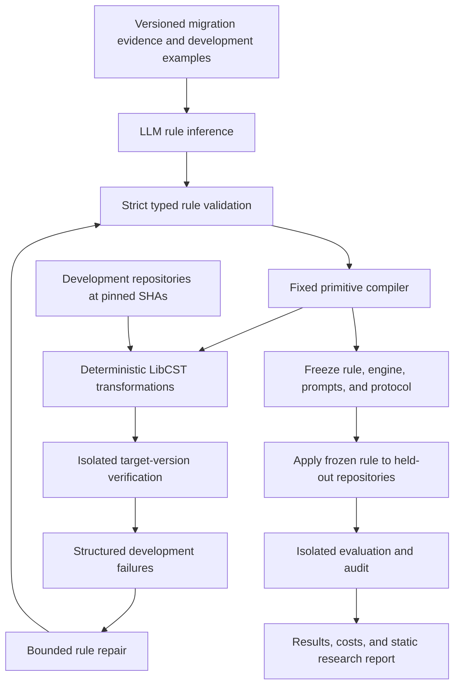

# Molt

**Molt is a planned research system for LLM-assisted, cross-repository source-code migration.** It asks an LLM to produce a constrained, reusable migration rule, compiles that rule into deterministic Python transformations, and evaluates it across independent repositories.

**Status: planning only.** This repository currently contains this README and the [development roadmap](DOCS/ROADMAP.md). There is no transformation engine, rule schema, CLI, benchmark dataset, or experimental result yet. The project name is **Molt** throughout.

## Research question

> Can an LLM generate constrained, reusable source-code migration rules that generalize across independent repositories more accurately and cheaply than directly asking an LLM to patch every repository?

A breaking dependency change can require similar edits in many projects. Direct LLM patching repeatedly spends reasoning effort on the same migration, while manually authored codemods require expertise and development time. Molt investigates whether an LLM can help author a restricted transformation once, with enough precision and coverage to make reuse worthwhile.

The intended contribution is an evaluated combination of **constrained rule generation, cross-repository generalization, rule-level repair, and amortized reasoning cost**. Accuracy and savings are hypotheses, not established properties.

## Reason once, apply repeatedly

| Direct LLM patching | Molt |
| --- | --- |
| Repository A → LLM → patch A | Migration evidence → LLM → reusable rule |
| Repository B → LLM → patch B | Same rule → deterministic patch A |
| Repository C → LLM → patch C | Same rule → deterministic patches B and C |
| Repository-local retries consume additional reasoning | Development failures may revise the shared rule within a fixed budget |

Both approaches must pass the same verification protocol. Molt cannot hide unsupported cases behind an apparently successful no-op, and the direct baseline must be a credible repository-aware patcher.

The simple cost hypothesis, for one migration, is:

```text
C_direct(n) = nL
C_Molt(n)   = R + nD
```

Here, `L` is mean LLM patching cost per repository, `R` is total rule-generation and rule-repair cost, and `D` is deterministic application cost per repository. If `L > D`, equal cost occurs at `n = R / (L - D)`; Molt becomes strictly cheaper above that point. If `L <= D`, there is no eventual saving under this model. Actual measurements must also account separately for verification, setup, failures, and human effort. Cheap incorrect patches do not establish a useful break-even point.

## Planned architecture



**The held-out path has no repair feedback edge.** Rule development and repair use development repositories only. Held-out source and outcomes cannot inform Molt rule selection or changes; each held-out repository receives the frozen rule. The direct baseline may inspect its assigned repository and receive the development-style diagnostics allowed by its frozen policy, but cannot access private evaluation probes or other repositories' attempts.

A separate admission process first verifies every benchmark repository against its original dependency version. A controlled dependency upgrade must then expose a relevant migration failure before any method is evaluated. Dependency pins and lockfile changes belong to a shared experiment setup, not to generated rules.

## V1 scope and rule philosophy

V1 targets Python and two dependency migrations, aiming for **15–30 viable independent repositories per migration, including development and held-out sets**. The experiment should include Tier 1 syntactic changes and meaningful Tier 2 structural changes; Tier 3 behavioral migrations are deferred. The exact migrations remain to be selected through feasibility checks.

Rules will be versioned Pydantic/JSON data composed from a small set of fixed primitives:

- `rename_symbol`, `change_import`
- `rename_argument`, `add_argument`, `remove_argument`
- `replace_call`, with restricted typed captures and argument mappings

`wrap_expression` and broader `change_attribute` support are later candidates, not V1 commitments. Rules cannot contain executable Python, arbitrary predicates, shell commands, or repository-specific patch payloads. The trusted engine constructs CST nodes from validated data; it does not execute generated code.

The planned engine uses LibCST matchers, `QualifiedNameProvider`, and `ScopeProvider` to preserve formatting and distinguish imported symbols from unrelated names. Qualified names can be ambiguous, so matching must abstain when the required evidence is unavailable. [LibCST metadata documentation](https://libcst.readthedocs.io/en/latest/metadata.html).

Pyright is planned for type verification where applicable. Any additional use of type information to authorize edits needs a separately tested integration; JSON diagnostics alone are not a symbol-resolution API. [Pyright command-line interface](https://github.com/microsoft/pyright/blob/main/docs/command-line.md).

Core invariants are deterministic output, idempotence, explicit preconditions, preserved evaluation order, no unrelated edits, and recorded abstentions. Determinism and schema validity do not prove semantic correctness.

## Research positioning

Reusable codemods and inferred edit patterns are established work. Molt must be evaluated against that history, including current systems that assist recipe authoring.

| Prior art | Relevance to Molt |
| --- | --- |
| [REFAZER](https://arxiv.org/abs/1608.09000) | Learns transformations from examples using a DSL and program synthesis. Learning reusable transformations is not a new premise. |
| [LASE / systematic editing](https://www.cs.utexas.edu/~mckinley/papers/lase-icse2013.pdf) | Generalizes example edits and locates other places to apply them. Context and edit generalization are central precedents. |
| [Meditor](https://people.cs.vt.edu/nm8247/program_transformation.html) | Infers and applies API migration edits, including edits beyond API replacement. Migration inference is established research. |
| [OpenRewrite / Moderne](https://docs.openrewrite.org/) | Provides reusable refactoring recipes and execution across repositories. Neither deterministic recipes nor repository-scale reuse are novelty claims. |
| [GritQL](https://github.com/biomejs/gritql) | Offers declarative code search and transformation with reusable patterns. A constrained rule language needs justification against existing alternatives. |
| [Piranha](https://github.com/uber/piranha) | Demonstrates rule-based refactoring and propagation of related cleanup edits. |
| [Comby](https://comby.dev/) | Provides structural search and replace, a useful reference for the boundary between textual and syntax-aware rewriting. |
| [Rector](https://github.com/rectorphp/rector) | Demonstrates established automated upgrades and refactoring in PHP; conceptual prior art, outside Molt's Python benchmark. |
| [SWE-bench](https://www.swebench.com/SWE-bench/guides/evaluation/) / [SWE-agent](https://arxiv.org/abs/2405.15793) | Inform executable repository evaluation and a credible direct-agent baseline. Molt studies dependency migrations, not general issue resolution. |

The research goal is to measure what a small LLM-facing rule interface gains and loses: coverage, precision, repair transfer, and cost across unseen client repositories of a known migration. This does not establish generalization to unseen migrations or claim that Molt is the first system combining LLMs and codemods. Phase 0 includes a broader literature and tooling review before stronger claims are made.

## Benchmark and evaluation plan

Repositories will be pinned to commit SHAs, admitted under pre-registered criteria, and grouped to prevent forks or shared code from crossing the development/held-out boundary. Original installation and existing tests must pass. Tests remain unchanged during migration; frozen external probes supplement weak API coverage. Exclusions, infrastructure failures, unsupported constructs, and abstentions remain visible.

The planned comparisons are:

1. Naive regex/text replacement.
2. Direct LLM repository patching under a recorded model, context, tool, and retry budget.
3. Molt with bounded development-only rule repair: at most three proposals total, including the initial proposal.
4. An official or expert codemod where available, with provenance and configuration recorded.
5. Molt without repair, using the same initial proposal as the repaired arm.

The primary outcome is repository success under a fixed verification contract. Supporting measures include syntax/build success, applicable Pyright/typecheck success, unchanged test-suite pass rates, audited false positives and missed edits, LLM calls/tokens/cost, runtime, repair iterations, migration difficulty, marginal cost, amortized cost curves, and uncertainty intervals. Results must report both correctness and cost, not just passing tests or low token usage.

The dataset should contain at least one low-exposure, obscure, or sufficiently recent migration where feasible. Dates and exposure proxies are evidence of reduced contamination risk, not proof that a model has never seen a migration or repository. With only two migrations, conclusions remain specific and exploratory.

## Repository and development

Current files:

```text
README.md          Project overview and research boundaries
DOCS/ROADMAP.md    Implementation phases, experiment protocol, and milestone gates
```

There is no runnable setup yet; installation and CLI commands will be documented when implemented and verified. Start with [Phase 0 and the milestone gates](DOCS/ROADMAP.md). The roadmap proposes a small Python package, local experiment artifacts, and a generated static report; its module paths are plans, not existing features.

Contributions should identify a roadmap phase, its acceptance criteria, and the evidence needed to close it. Prioritize methodology, adversarial transformation fixtures, reproducible repository environments, and a manually authored rule before LLM integration. Keep benchmark tests immutable and document protocol amendments before viewing held-out method outcomes.

## Limitations and boundaries

Python's dynamic imports, monkey-patching, re-exports, ambiguous receivers, and unpacked arguments can defeat conservative static matching. Restricting the DSL can improve auditability while reducing migration coverage. Passing tests cannot prove behavioral equivalence, and rule repair can overfit development repositories. Containers improve reproducibility but are not a complete security boundary for arbitrary third-party code.

V1 excludes a React/SaaS dashboard, authentication, billing, a GitHub App or automatic production PRs, a custom code-property graph or Python language server, an ML confidence model, multiple languages, vector databases, Kubernetes, and a large multi-agent architecture. Productization is deferred until the research system produces credible, reproducible results—including negative results. A generated HTML/static research report is sufficient.
